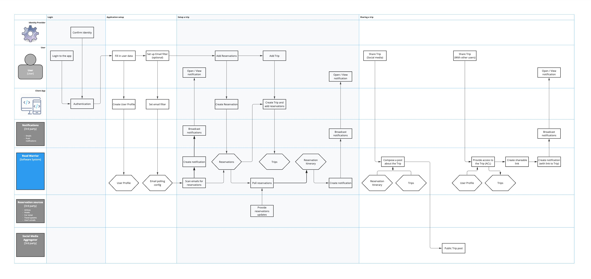

# The Profitero Data Alchemists Architectural Kata by O'Reilly, September 2023

## Team members

- [Ilya Hardzeenka](https://www.linkedin.com/in/ilya-hardzeenka/)
- [Arkadzi Salnikau](https://www.linkedin.com/in/arkadzi/)
- [Denis Klimenko](https://www.linkedin.com/in/den1sklimenko/)
- [Dmitry Trofimov](https://www.linkedin.com/in/tdslinkedin/)
- [Oleg Zubchenko](https://www.linkedin.com/in/rgbd-me/)

## Contents

TODO

## Welcome

Welcome to the Profitero Data Alchemists Architectural Kata run by O'Reilly in September 2023.
We are the architecture team within Profitero, a midsize product company, which gather, enhance, and deliver ecommerce data to our global customer base. 

Our mission is to design and shape the foundation upon which data flows, insights are born, and solutions are built. 

As architects, we understand the power and potential of data to transform industries, drive efficiencies, and unlock new possibilities. We are at the forefront of organizing, securing, and optimizing data ecosystems to unleash their full potential.

In our work we mainly utilize following techniques:
- [Viewpoints and Perspectives Framework by Rozanski,Woods](https://www.viewpoints-and-perspectives.info/)
- [C4 Modeling approach](https://c4model.com/)

## Business Case

### Background
The travel industry is evolving rapidly, with millions of travelers seeking efficient ways to manage their trips. The Road Warrior aims to address this need by providing a user-friendly, feature-rich platform that consolidates travel-related information and enhances the overall travel experience.

### Market Opportunity

- 15 million potential users.
- Competitive advantage through real-time travel updates.
- Analytics data can be monetized for market insights.

### Objective
To develop an innovative online trip management dashboard that offers travelers a comprehensive platform to organize and manage their reservations seamlessly.

### Benefits

- Simplifies trip management for travelers.
- Enhances user experience through real-time updates.
- Facilitates data-driven decision-making for travelers and travel industry stakeholders.

## Requirements

For the original requirements please follow [Original Requirements](requirements/original_requirements.md)

### Stakeholders

- **Customers or Users**: individuals or organizations use the application to fulfill specific needs or requirements. Their feedback and satisfaction are crucial for the success of the application.

- **Development Team**: Product Owners, software/infrastructure engineers, and testers responsible for designing, building, and testing, as well as deploying and maintaining the application in production.
- **Executive Leadership**: Senior executives and leadership teams provide strategic direction, allocate resources, and make critical decisions related to the project. They manage the financial, legal, and regulatory aspects of the project.
- **Marketing and Sales Teams**: promote the application, define target audiences, and provide input on features that can enhance marketability.
- **Support and Customer Service Teams**: assist users with issues, questions, and feedback, helping to maintain customer satisfaction and loyalty.

### Functional Requirements

#### Email Integration
- Periodically poll users' emails for travel-related information. 
- Ability to filter and whitelist certain emails based on user preferences.

#### Integration with Travel Systems
- Interface with existing travel systems (e.g., SABRE, APOLLO) for real-time updates.
- Interface with existing airline, hotel, and car rental agencies for real-time update.
- Updates must be reflected in the app within 5 minutes after update in Travel API, surpassing competition.

#### Manual Reservation Management
- Capability to manually add, update, or delete reservations within the system.

#### Trip-Based Organization
- The dashboard allows you to group reservations into trips.
- Items should be automatically removed from the dashboard at the end of the trip.

#### Social Media Integration
- Ability to share the trip's information on standard social media platforms.
- An option to share with specific individuals should also be available.

#### Rich User Interface
- Ensure a visually appealing and responsive user interface across all deployment platforms (web and mobile).

#### End-of-Year Summary Reports
- Provide users with comprehensive end-of-year summary reports, including various travel metrics.

#### Analytical Data Collection
- Collect and analyze user trip data for purposes like travel trends, vendor preferences, and update frequency.

#### International Compatibility
- The system must be designed to work seamlessly for travelers across international regions.
- User interface must be available in multiple languages.

### Non-functional Requirements

#### Availability
- High system availability, with a maximum of 5 minutes of unplanned downtime per month, that corresponds to 99.99% SLA

#### Performance
- Web response time should be limited to 800ms.
- Mobile app should have a First-contentful paint of less than 1.4 seconds.
- Travel updates must be presented in the app within 5 minutes of being generated by the source.

#### Scalability and Elasticity

- Handle up to 2 million active users and adjust accordingly when the load changes
- Handle reservations from 15M users, with 5 or even 10 active reservations each, which result in 150M reservations to be refreshed every 5 minutes.

#### Evolvability
- This is growing StartUp - which means we should aim to react to market changes and user feedback almost immediately.

### Assumptions
- All agency APIs, including those for airlines, hotels, and car rentals, provide a standardized integration interface. The primary difference among them lies in the specific endpoints used for communication.

- To cover more users with less effort, we decided to integrate with the top three email providers: Gmail, Outlook, and iCloud Mail. These providers have been prioritized for integration efforts.

- Reservation data can be updated from various sources, including email, agency APIs, and travel systems APIs. This flexibility allows for comprehensive reservation management and real-time updates from multiple channels.

# Proposed Architecture

## Architecture Style

### Driving characteristics
While conducting requirements analysis, various architectural characteristics that held significance for the system were identified.

| Top | Characteristic   | Description                                                                                                                                                                                                                           | 
|-----|------------------|---------------------------------------------------------------------------------------------------------------------------------------------------------------------------------------------------------------------------------------|
|  x  | Performance      | Performance optimization is essential to provide a responsive and user-friendly experience across all platforms.                                                                                                                      |
|     | Responsivenes    | Response time from the web should be limited to 800ms, and mobile should have a First-contentful paint of under 1.4 seconds.                                                                                                          |
|  x  | Scalability      | With 15 million user accounts and 2 million active users per week, scalability is a top priority.                                                                                                                                     |
|     | Elasticity       | The system must efficiently handle a large user base and potential spikes in usage, especially during peak travel times.                                                                                                              |
|     | Interoperability | Integration with external systems (SABRE, APOLLO) and the travel agencies demands an architecture that can evolve to accommodate changes in these systems' APIs or protocols.                                                         |
|  x  | Evolvability     | As user feedback and market trends emerge, there may be a need to introduce new features or services. Evolvability allows for the seamless addition of new functionalities without disrupting existing operations.                    |

The architecture team unanimously agreed on the importance of characteristics like Performance and Scalability. However, when faced with the choice between Elasticity and Evolvability, the team opted for the latter. The rationale behind this decision is that, as a startup, the ability to adapt to user feedback and market dynamics is paramount. The team recognized that the startup's success hinges on its agility to implement changes based on user reactions and shifting market conditions.

In alignment with the top three key characteristics, the team selected an **event-driven architecture** as the most suitable approach.

#### Implicit Architecture Characteristics

| Characteristic | Description                                                                                                                                                                                                                              |
|---------------|------------------------------------------------------------------------------------------------------------------------------------------------------------------------------------------------------------------------------------------|
| Availability     | Users must be able to access the system at all times, with a maximum of 5 minutes per month of unplanned downtime.   - High availability is crucial to ensure that travelers can access their trip information whenever they need it. |
| Security      | Filtering and whitelisting certain emails are security measures to prevent unwanted or malicious emails.  - Ensuring the security of user data and interactions is essential, especially in the context of travel-related information. |
| Maintainability | Maintainability is critical for managing and analyzing data over time, adapting to changing requirements. Especially for just launched product on the market                                                                             | 

## Functional Viewpoint

> *Describes the system’s functional elements, their responsibilities, interfaces, 
> and primary interactions*

Based on functional requirements we identified main flow our application should support. 
Of coarse there are additional flows but all of them are connected to main one in some way.

**Legend for diagrams**

- **Actor**: User or System 
- **Function**: Action performed by Actor
- **Data Element**: May represent an object or it's attribute
- **Constraint**: Functional limitation introduced to simplify system

### Main Flow

The primary flow of our application begins with user registration. Once a user successfully logs in, they have two main options: they can manually enter reservations or set up an email integration to automatically discover reservations in their inbox.
When a reservation is added to the system, it initiates a tracking process using partner APIs to monitor and update its details continuously. Any changes detected are then saved within our system. Users are promptly notified of these changes through push notifications on their mobile devices, email alerts, or pop-up messages on the web.
Since users may have multiple reservations, we provide a feature allowing them to group these reservations into a "Trip." These trips can be viewed by the user or shared via social media as public posts or within the app to another user.

Additional functional flows described below:

- [Work with User Profile](functional_viewpoint/README.md#work-with-user-profile)
- [Email reservations discovery](functional_viewpoint/README.md#email-reservations-discovery)
- [Work with reservations](functional_viewpoint/README.md#work-with-reservations)
- [Reservations tracking](functional_viewpoint/README.md#reservations-tracking)
- [Work with trips](functional_viewpoint/README.md#work-with-trips)
- [Sharing Trips](functional_viewpoint/README.md#sharing-trips)
- [Work with travel agencies](functional_viewpoint/README.md#work-with-travel-agencies)
- [Analytical reports](functional_viewpoint/README.md#analytical-reports)

## Context Viewpoint

> *Describes the relationships, dependencies, and interactions between the system and its environment (the people, systems, and external entities with which it interacts).*

### Level 1 - System Context

> *A System Context Diagram is a high-level visual representation that depicts a system or software application in its broader context. It illustrates how the system interacts with external entities, such as users, other systems, or data sources.*

As we can see the system has many-many integration points:
 * **User** that interacts with the system through the web application in the browser or through the mobile application.
 * **Support user** that does special actions in application such as maintaining available Travel Agencies or generating a vendor analytical report.
 * **Identity API** is used to verify the identity of the user who logs into the application. It also provides basic info about the user, that they agreed to provide during the registration.
 * **User Email API** provides the ability to discover new reservations by user email polling (if allowed by the user).
 * **Travel Agencies API** provides updates for reservations that were added by users or discovered in user email. E.g. Hotel, Airline or Car rental API.
 * **Travel Systems API** also provides updates and details for reservations. E.g. SABRE, APOLLO
 * **Social Media** provides APIs to share the post in user's social media accounts.
 * **Notifications** are used to send user notifications such as emails or push notifications for mobile applications.

### Level 2 - Container diagram - Road Warrior

> *The Container diagram shows the high-level shape of the software architecture and how responsibilities are distributed across it. It also shows the major technology choices and how the containers communicate with one another*

In the first phase we want to enable users interaction with the system in general. To make this possible, we have introduced the following components:
- **Road Warrior UI**: This is a web application, with all static content hosted on a global Content Delivery Network (CDN).
- **Gateway API**: This component operates as a REST API, serving as a centralized entry point for all external incoming requests. Its responsibilities include user authentication and the orchestration of business logic across microservices. 
- To verify user identity **Gateway API** interacts with **Identity API**.

The next phase involves enabling users to interact with reservations, trips, user profiles, and more. To achieve this, we're introducing the Data Readers/Updaters Container:
- **Data Readers**: These components provide data to the Gateway API and other microservices within the system. 
They will implement search and filtering capabilities and the ability to retrieve full objects by their unique IDs.
- **Data Updaters**: These components are responsible for applying changes to objects in the database and ensuring their consistency and integrity are maintained.

Now, as we've enabled manual operations with objects, it's time to automate the tracking and discovery of reservations. 
To achieve this, we've introduced the Trackers Container:
- **Emails Tracker**: This service is responsible for scanning users' email inboxes, searching for reservations, and extracting all the necessary information from them. 
Its primary role is to discover new reservations. 
It interacts with email via API, respecting user settings and permissions.
- **Reservation Trackers**: These services are responsible for ensuring that we have the latest reservation itineraries. 
They maintain their internal state of active reservations to track changes. 
- Any identified changes are then passed on to the **Data Updaters** for persistence in the database.

In conclusion, we must address how the system communicates with the external world. To facilitate this, we're introducing the Sharing and Notification Containers:
- **Sharing**: This component empowers users to share their Trips and Reservations with others within the app or create posts for sharing on their preferred social media platforms. To ensure a seamless user experience, it will interact with Social Media Aggregators, which will be specified later.
- **Notification Publisher**: This component takes on the responsibility of informing users about significant changes to their reservations and notifying them when someone shares content with them within the app. 
It achieves this by interacting with external Notification APIs to deliver emails and push notifications to mobile apps.

The final but equally essential function is the ability to generate analytical reports. To accomplish this, we introduce the Reporting Container:
- **Analytical Reports Generator**: This service extracts data through the Data Reader and generates monthly Vendor reports. These reports can be accessed by Support personnel or annual user reports, providing insights into their travel history for the past year. This feature enables data-driven decision-making and enhances the overall functionality of the system.

### Level 3 - Containers

> *The Component diagram shows how a container is made up of a number of "components", what each of those components are, their responsibilities and the technology/implementation details.*

- #### [Emails Trackers](context_viewpoint/README.md#level-3---container---emails-tracker)
- #### [Reservation Trackers](context_viewpoint/README.md#level-3---container---reservation-trackers)
- #### [Notification Publisher](context_viewpoint/README.md#level-3---container---notification-publisher)
- #### Sharing
- #### Analytical Reports Generator
- #### User Data Reader/Updater
- #### Reservation Data Reader/Updater
- #### Travel Agencies Data Reader/Updater
- #### Notifications Data Reader/Updater
- #### Trips Data Reader/Updater

## Concurrency Viewpoint

> *Describes the concurrency structure of the system and maps functional elements to concurrency units to clearly identify the parts of the system that can execute concurrently and how this is coordinated and controlled.*

In this viewpoint, we aim to illustrate how our solution facilitates **scalability** (capable of accommodating up to 15+ million users and beyond), **elasticity** (able to expand and adapt to unanticipated peak loads during weekends and holiday seasons), and **performance** (ensuring responses are consistently achieved within the 800ms threshold).

To meet these three requirements effectively, it makes sense to leverage the following advantages:

- utilizing a partitioned NoSQL database;
- using topics (including compacted) within a distributed event streaming platform, such as Kafka;
- employing autoscaling instances;
- implementing a load balancer.

### Concurrency Diagram - Level 1

Three scaling groups was defined:

#### API Scaling Group:

- This group is responsible for handling user requests, and the call triggers are the system users.
- It ensures efficient processing of incoming requests and can scale horizontally to meet varying user demand.

#### Data Readers/Updaters Scaling Group:

- Dedicated to reading and updating data entities, this group responds to tasks initiated by other actors.
- It facilitates data retrieval and manipulation efficiently and can adjust its capacity based on workload.

#### Messaging Scaling Group:

- This group specializes in processing tasks within a queue of messages/tasks.
- Its members operate independently, executing tasks from a predefined task list.

Scaling ensures that the messaging workload is managed effectively.
These scaling groups optimize resource allocation and task handling across the system, enhancing performance and responsiveness.

> **Note**: In this illustrations, data streams for reading and writing are depicted using black and red arrows, respectively.

### Concurrency Diagram - Level 2

You can find further information below regarding the specific functioning of individual scaling groups:

- [API Actors](concurrency_viewpoint/README.md#concurrency-diagram---level-2---api-actors)
- [Data Readers/Updaters](concurrency_viewpoint/README.md#concurrency-diagram---level-2---data-readersupdaters)
- [Messaging Actors](concurrency_viewpoint/README.md#concurrency-diagram---level-2---messaging-actors)

## Development Viewpoint

> *Describes the architecture that supports the software development process.*

When designing a software architecture, it's crucial to consider how it will be developed. 
Evolvability, the ability to make changes over time, is a critical non-functional requirement. 
A well-structured development process, enhanced by automation, enables quick changes while maintaining product quality at a reasonable level.
There are several decisions to make regarding the development process:
- **[Code Storage and Structure](development_viewpoint/README.md#code-structure)**: 
We will begin our app with two mono repositories: one for the frontend (covering both web and mobile apps) and another for all the backend microservices. This approach allows us to efficiently manage development in the early stages and maximize code reuse. It's important to note that a well-structured monorepo can always be divided into smaller repositories if needed.
To ensure flexibility and minimize direct code dependencies, we'll implement a strategy where code sharing occurs through libraries or plugins managed as separate artifacts. This way, we maintain modularity and can quickly adapt to changing requirements in the future.
- **[Code Merge Strategy](development_viewpoint/README.md#code-merge-strategy)**: 
Due to constraints on our mobile app release schedule, we've opted to implement **[GitLab Flow](development_viewpoint/README.md#gitlab-flow)** for both frontend and backend development. This choice aims to streamline joint releases and simplify our overall workflow.
- **[Automation vs. Manual Processes](development_viewpoint/README.md#automation-vs-manual)**:
For our app we decided to use full testing automation for the backend, while keeping manual QAs for frontend. 
Frontend testing automation is very sensitive and time-consuming process, while app is developing it will increase our time to market.
- **DevOps Platform**: Something like GitLab or GitHub will work for us.  

## Deployment Viewpoint

> *Describes the environment into which the system will be deployed, including capturing the dependencies the system has on its runtime environment.*

We plan to establish two stable environments—one for production workloads and another for non-production tasks. Both will be created and managed through Infrastructure as Code (IaaC). While setting up these environments may take some time initially, they will substantially simplify future changes and enhance overall stability in the long run.

Our strategy involves leveraging third-party DevOps and Observability platforms to avoid the need to dedicate time to setting up development and monitoring tools. This approach allows us to focus more on our core development and operational tasks while benefiting from the capabilities offered by established platforms.

### Environment

From a deployment perspective, our primary concern is achieving an exceptionally high availability SLA of 99.99%. To meet this stringent standard, we must meticulously design our environments. Here are the main components of these environments:
- **Network**: To attain the desired SLA, we propose initially employing multi-zone deployment within a single region. We recommend against multi-region deployment due to added network costs for inter-region communication. Access to the network should be facilitated through Public Load Balancers with built-in firewalls capable of handling external threats and internal failures.
- **Microservices Runtime**: We strongly advocate utilizing Kubernetes as the resource manager for managing microservices efficiently. Kubernetes has built-in auto scalers and internal load balancers, making it well-suited for meeting our scaling and elasticity requirements.
- **Message Broker**: To support an event-driven architecture effectively, employing a scalable message broker is imperative. We recommend using Kafka, a widely recognized and industry-tested software for handling large-scale event streaming. We propose deploying self-hosted open-source Kafka within the Kubernetes environment. This approach helps with cost savings in the initial project phases and aligns with our scalability goals.
- **Database**: To achieve a highly scalable and available system while keeping performance at exceptional level, opting for a NoSQL clustered database is essential. We recommend using self-managed MongoDB for reasons similar to the Message Broker's. Self-management within Kubernetes enables us to control costs while ensuring robust database performance and availability.

By meticulously designing and implementing these components, we aim to create symmetrical environments for both production and non-production workloads, ultimately meeting our demanding SLA requirements and ensuring the stability and resilience of our system.

## Informational Viewpoint

> *Describes the way that the architecture stores, manipulates, manages, and distributes information.*

The data model is pivotal in any application, directly impacting performance and scalability. To meet these requirements effectively, we recommend adopting a NoSQL approach for data storage. Our proposal involves maintaining object-oriented tables to eliminate the need for complex joins. This approach offers several advantages:
- Exceptional Performance: By avoiding joins, we ensure outstanding performance for both read and write operations.
- Horizontal Scalability: We can quickly scale our database horizontally by partitioning data across multiple nodes, supporting our scalability needs as the application grows.

This strategy enhances performance and provides the flexibility needed to accommodate increasing data volumes and user loads.

[Here you can find more details about proposed data model](information_viewpoint/README.md#here-you-can-find-more-details-about-proposed-data-model)

## Operational Viewpoint

> *Describes how the system will be operated when it is running on production environment.*

Here we connect the main user flow with the system context. The base things a user do in the application are:
- **[Login](operational_viewpoint/README.md#login)**. The app needs to know who going to get help with his trips.
- **[Setup application](operational_viewpoint/README.md#application-setup)**. The user has to register a profile in the app to create a context and establish rules.
- **[Setup a trip](operational_viewpoint/README.md#setup-a-trip)**. The travel is being planned, thus the user shares with the application what to track by adding reservations into the system.
- **[Share a trip](operational_viewpoint/README.md#share-a-trip)**. It is always useful to be able to share your experience easily.

Then the Road Warrior application steps into play. The application can collect reservations automatically, tracking updates and allows making changes. The system will inform the traveler and let him keep friends up to date.
 To do the staff, the system involves:

The client side:
- The user, firstly.
- The web/mobile application.

The Road Warrior system:
- All services we put on servers.  

A number of Third party we need to provide our features:
- **Identity providers for authentication**. So a user can use usual identity for simple login.
- **Reservation sources**. Travel agencies and travel systems where we can collect actual information and same time and efforts for the user.
- **Notifications services**, to keep the user informed regardless of the device he is using.
- **Social media aggregator**. The service connecting us to social networks.

The next schema shows how all it works together to satisfy  our users:

## Implementation milestones
Implementing the startup approach for "The Road Warrior," which emphasizes launching a Minimum Viable Product (MVP) quickly, gathering user feedback, and continuously integrating external APIs and data providers, requires a different set of implementation milestones.

| Iteration | Goal | Tasks                                                                                                                                                                                                                                                                                                                                                               |
|-----------|--|---------------------------------------------------------------------------------------------------------------------------------------------------------------------------------------------------------------------------------------------------------------------------------------------------------------------------------------------------------------------|
| **Start**     | Project initiation and planning | - Define project objectives and scope. - Assemble Scrum teams. - Create a high-level project plan.  - Set up communication and collaboration tools. - Conduct initial backlog refinement. |
| **MVP Development**     |  Develop the MVP for web and initiate mobile app development (Android or iOS) | - Define MVP features, prioritizing essential functionalities.   - Set up development environments for web and mobile.  - Develop core features, including email polling, basic reservation management, and basic UI.  - Implement basic authentication for web and mobile with limited list of providers.  - Plan for rapid deployment of the MVP. |
| **MVP Deployment and Beta Testing** | Deploy the MVP to a limited user base for beta testing. | - Conduct internal testing to ensure stability. - Create a beta user group and recruit participants. - Deploy the MVP to beta users on web and mobile. - Gather user feedback through surveys, in-app feedback forms, and user interviews.  |
| **MVP Feedback Integration** | Integrate user feedback and make improvements to the MVP. | - Analyze user feedback and prioritize enhancements. - Iterate on UI/UX improvements based on beta user input. - Address critical issues and bugs identified during beta testing. - Deploy updated versions of the MVP to beta users. |
| **Initial API Integration** | Begin integrating external APIs and data providers. | - Identify and prioritize external APIs and data sources for integration (e.g., travel data providers, social media APIs). - Develop API integration modules. - Conduct initial testing of integrated data sources. - Ensure that MVP features benefit from external data sources. |
| **Version 1.0 Release** |  Release an improved version of the MVP with additional features. | - Implement features based on user feedback (e.g., improved reservation management, social media sharing). - Enhance UI/UX based on beta user input. - Perform additional testing to ensure stability. - Launch Version 1.0 for both web and mobile. |
| **Continuous Feedback and Iteration** | Continuously gather feedback and iterate on the product. | - Maintain a feedback loop with beta users. - Prioritize and implement features and enhancements based on user needs. - Address bugs and issues promptly. - Deploy regular updates to improve the user experience. |
| **API Expansion and Data Providers** | Consistently connect new external APIs and data providers. | - Identify and evaluate new API and data source opportunities. - Develop and test API integrations. - Ensure seamless data synchronization and accuracy. - Continuously expand the range of travel-related data available to users.  |
| **Adding the Second Mobile App Platform** | Initiate development for the second mobile app platform (Android or iOS, whichever was not chosen initially). | - Set up the development environment for the second mobile app platform. - Adapt existing MVP features and improvements to the second platform. - Implement authentication and ensure feature parity with the first platform. |
| **MVP Deployment for Second Platform** | Deploy the MVP to a limited user base for beta testing on the second mobile app platform. | - Conduct internal testing to ensure stability for the second platform. - Create a beta user group and recruit participants for the second platform. - Deploy the MVP to beta users on the second platform. - Gather user feedback through surveys, in-app feedback forms, and user interviews for the second platform. |
| **Version 2.0 Release** | Launch a feature-rich Version 2.0 of the product. | - Implement advanced features (e.g., travel trends analytics, advanced reporting). - Enhance UI/UX based on user feedback and industry trends. - Perform extensive testing, including performance and security. - Plan a marketing campaign for the Version 2.0 launch. |
| **Scaling and User Growth** | Scale infrastructure and expand the user base. | - Monitor system performance and scalability. - Optimize server and database resources. - Implement marketing strategies to acquire new users. - Address scaling challenges as user numbers grow. |
| **Continuous Improvement** | Continuously improve the product and user experience. | - Gather feedback from a growing user base. - Stay updated with industry trends and new API opportunities. - Implement regular updates and improvements. - Plan for long-term product evolvability. |

## Architecture decision records

- ### [ADR-1](adrs/adr-1-architecture-style.md) Use Event-Driven Architecture style
- ### [ADR-2](adrs/adr-2-api-layer.md) Use API layer as single point of contact for all user interfaces 
- ### [ADR-3](adrs/adr-3-data-reader.md) Use API based synchronous Data Readers
- ### [ADR-4](adrs/adr-4-data-updater.md) Use messaging based asynchronous Data Updaters
- ### [ADR-5](adrs/adr-5-trackers.md) Use messaging based asynchronous Trackers
- ### [ADR-6](adrs/adr-6-sharing.md) Use API based synchronous Sharing service
- ### [ADR-7](adrs/adr-7-publishers.md) Use messaging based asynchronous Publishers
- ### [ADR-8](adrs/adr-8-scaling-groups.md) Use separate Scaling Groups for different workloads
- ### [ADR-9](adrs/adr-9-topics.md) Use topics and compacted topics for message handling
- ### [ADR-10](adrs/adr-10-partitioning-key.md) Use same Partitioning Key for corresponding topics and tables
- ### [ADR-11](adrs/adr-11-monorepos.md) Use separate Monorepo for Frontend and Backend
- ### [ADR-12](adrs/adr-12-gitlab-flow.md) Use GitLab Flow Merge strategy
- ### [ADR-13](adrs/adr-13-infrastructure.md) Use Multi Zone Infrastructure
- ### [ADR-14](adrs/adr-14-no-sql-database.md) Use self-managed NoSQL Database with object-oriented model
- ### [ADR-15](adrs/adr-15-message-broker.md) Use self-managed Message Broker
 
