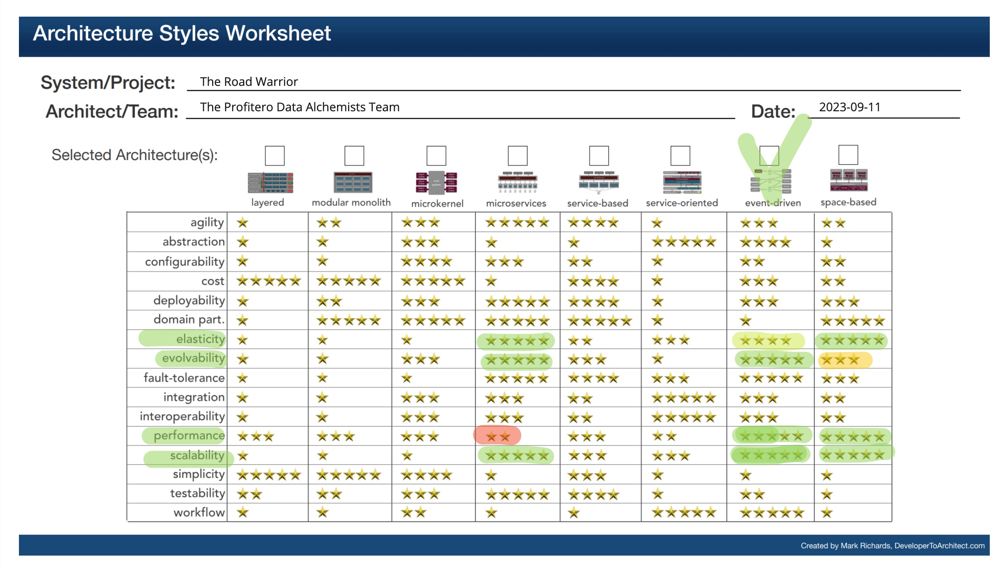

## Architecture Characteristics

### Driving characteristics
While conducting requirements analysis, various architectural characteristics that held significance for the system were identified.

| Top | Characteristic   | Description                                                                                                                                                                                                                                 | 
|-----|------------------|---------------------------------------------------------------------------------------------------------------------------------------------------------------------------------------------------------------------------------------------|
|  x  | Performance      | - Performance optimization is essential to provide a responsive and user-friendly experience across all platforms.                                                                                                                          |
|     | Responsivenes    | - Response time from the web should be limited to 800ms, and mobile should have a First-contentful paint of under 1.4 seconds.                                                                                                              |
|     | Availability     | - Users must be able to access the system at all times, with a maximum of 5 minutes per month of unplanned downtime.   - High availability is crucial to ensure that travelers can access their trip information whenever they need it. |
|  x  | Scalability      | - With 15 million user accounts and 2 million active users per week, scalability is a top priority.                                                                                                                                         |
|     | Elasticity       | - The system must efficiently handle a large user base and potential spikes in usage, especially during peak travel times.                                                                                                                  |
|     | Interoperability | - Integration with external systems (SABRE, APOLLO) and the travel agencies demands an architecture that can evolve to accommodate changes in these systems' APIs or protocols.                                                             |
|  x  | Evolvability     | - As user feedback and market trends emerge, there may be a need to introduce new features or services. Evolvability allows for the seamless addition of new functionalities without disrupting existing operations.                        |

The architecture team unanimously agreed on the importance of characteristics like Performance and Scalability. However, when faced with the choice between Elasticity and Evolvability, the team opted for the latter. The rationale behind this decision is that, as a startup, the ability to adapt to user feedback and market dynamics is paramount. The team recognized that the startup's success hinges on its agility to implement changes based on user reactions and shifting market conditions.

In alignment with the top three key characteristics, the team selected an event-driven architecture as the most suitable approach.

### Implicit Architecture Characteristics

| Characteristic  | Description                                                                                                                                                                                                                                  |
|-----------------|----------------------------------------------------------------------------------------------------------------------------------------------------------------------------------------------------------------------------------------------|
| Security        | - Filtering and whitelisting certain emails are security measures to prevent unwanted or malicious emails.  - Ensuring the security of user data and interactions is essential, especially in the context of travel-related information. |
| Maintainability | - Maintainability is critical for managing and analyzing data over time, adapting to changing requirements. Especially for just launched product on the market                                                                               |
| 
