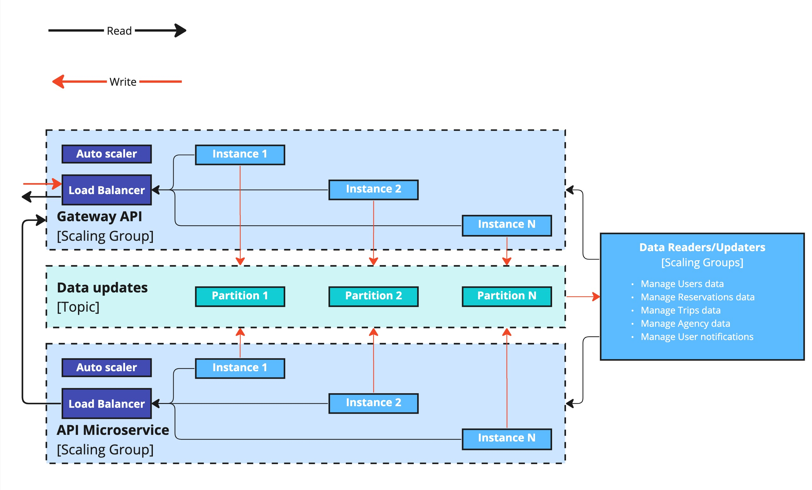
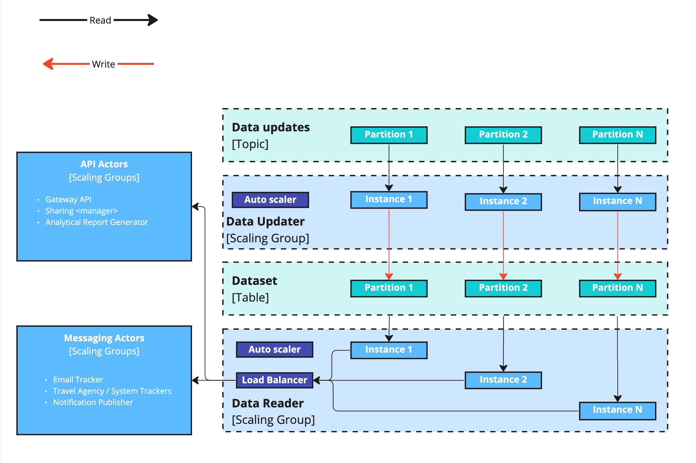

# Concurrency Viewpoint

> *Describes the concurrency structure of the system and maps functional elements to concurrency units to clearly identify the parts of the system that can execute concurrently and how this is coordinated and controlled.*

In this viewpoint, we aim to illustrate how our solution facilitates **scalability** (capable of accommodating up to 15+ million users and beyond), **elasticity** (able to expand and adapt to unanticipated peak loads during weekends and holiday seasons), and **performance** (ensuring responses are consistently achieved within the 800ms threshold).

To meet these three requirements effectively, it makes sense to leverage the following advantages:

- utilizing a partitioned NoSQL database;
- using topics (including compacted) within a distributed event streaming platform, such as Kafka;
- employing autoscaling instances;
- implementing a load balancer.

## Concurrency Diagram - Level 1

Three scaling groups was defined:

#### API Scaling Group:

- This group is responsible for handling user requests, and the call triggers are the system users.
- It ensures efficient processing of incoming requests and can scale horizontally to meet varying user demand.

#### Data Readers/Updaters Scaling Group:

- Dedicated to reading and updating data entities, this group responds to tasks initiated by other actors.
- It facilitates data retrieval and manipulation efficiently and can adjust its capacity based on workload.

#### Messaging Scaling Group:

- This group specializes in processing tasks within a queue of messages/tasks.
- Its members operate independently, executing tasks from a predefined task list.

Scaling ensures that the messaging workload is managed effectively.
These scaling groups optimize resource allocation and task handling across the system, enhancing performance and responsiveness.

> **Note**: In this illustrations, data streams for reading and writing are depicted using black and red arrows, respectively.

### Concurrency Diagram - Level 2 - API Actors

As API Actors are required to promptly respond to calls and dynamically accommodate fluctuations in workload, the proposed architecture incorporates scalability through autonomous instances. Load distribution among these instances is achieved through a Load Balancer, while communication with other system components is facilitated via a message queue structured as topics.

### Concurrency Diagram - Level 2 - Data Readers/Updaters

#### Data Updaters
We employ Data Updaters that scale through instances to manage changing workloads effectively. Each instance is responsible for processing tasks from one or more queue topics.
In this architecture, we assume that the partitioning key for the topic and table will be identical. This alignment enables the update microservice to transfer data without interruptions from other microservices. Consequently, we ensure that all updates for the same record are sequentially placed in the same partition, preventing collisions during updates.

#### Data readers
Due to the potential variance in update and read loads, we propose managing data reads with a distinct set of microservices. This approach will follow the standard API pattern, involving a load balancer and autoscaler to adapt to varying read demands from other components. This separation allows us to efficiently cater to both update and read workloads independently as needed.

### Concurrency Diagram - Level 2 - Messaging Actors

The diagram below illustrates the scaling principle for the most complex Messaging Actor: Reservation Trackers.
Key Components:
- **Compacted Topic (Partitioned)**: This core component employs a compacted topic partitioned by the reservation's primary key. Reservation Trackers periodically check for newly added or deactivated reservations and manage them within the compacted topic.
- **Reservation Tracker**: These trackers periodically scan for newly added or deactivated reservations and add or remove them within the compacted topic.
- **Itinerary Tracker**: This component continually re-reads the compacted topic and compares its data with the Travel API responses. If any changes are detected, it updates the message in the compacted topic. Each instance of the Itinerary Tracker is connected to one or more partitions, ensuring that no two instances are connected to the same partition. This design ensures that all updates for the same record are correctly ordered within the topic.
- **Reservations Updater**: This component captures updates made by the Itinerary Tracker and passes them for further processing.

The other messaging actors utilize the same approach: the topic as an input interface and a set of microservices with autoscaler to process messages.

