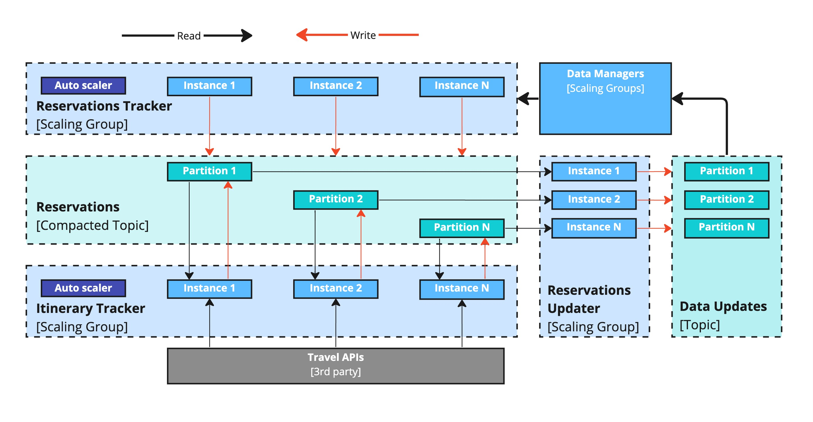

# Concurrency Viewpoint

The Concurrency view serves as a means to elucidate the concurrent elements, state-related structure, and associated constraints within the system. In this context, we aim to illustrate how our solution facilitates **scalability** (capable of accommodating up to 15+ million users and beyond), **elasticity** (able to expand and adapt to unanticipated peak loads during weekends and holiday seasons), and **performance** (ensuring responses are consistently achieved within the 800ms threshold).

To meet these three requirements effectively, it makes sense to leverage the following advantages:

- utilizing a partitioned NoSQL database;
- using topics (including compacted) within a distributed event streaming platform, such as Kafka;
- employing autoscaling instances;
- implementing a load balancer.

Concurrency Diagram - Level 1

Concurrency Diagram - Level 2 - Data Managers

Concurrency Diagram - Level 2 - API Actors

Concurrency Diagram - Level 2 - Message Actors

