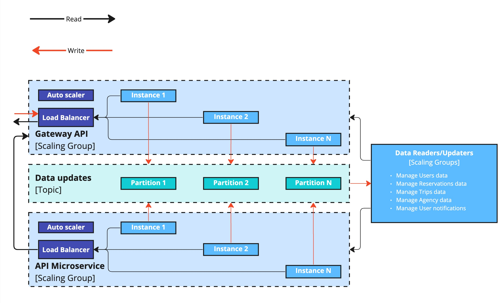
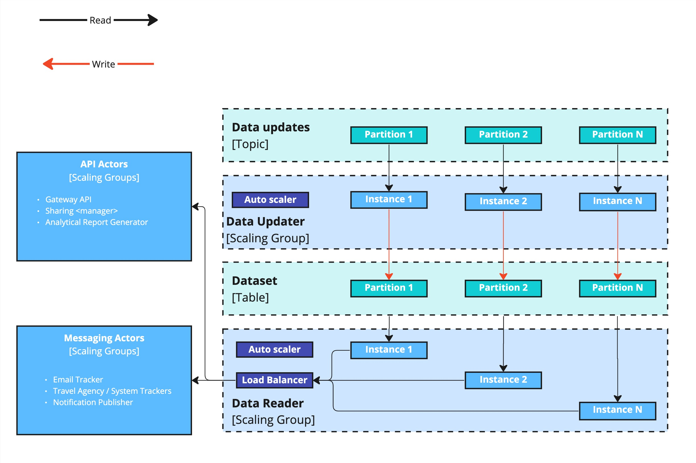

# Concurrency Viewpoint

The Concurrency view serves as a means to elucidate the concurrent elements, state-related structure, and associated constraints within the system. In this context, we aim to illustrate how our solution facilitates **scalability** (capable of accommodating up to 15+ million users and beyond), **elasticity** (able to expand and adapt to unanticipated peak loads during weekends and holiday seasons), and **performance** (ensuring responses are consistently achieved within the 800ms threshold).

To meet these three requirements effectively, it makes sense to leverage the following advantages:

- utilizing a partitioned NoSQL database;
- using topics (including compacted) within a distributed event streaming platform, such as Kafka;
- employing autoscaling instances;
- implementing a load balancer.

Concurrency Diagram - Level 1

Three scaling groups was defined:

### API Scaling Group:

- This group is responsible for handling user requests, and the call triggers are the system users.
- It ensures efficient processing of incoming requests and can scale horizontally to meet varying user demand.

### Data Readers/Updaters Scaling Group:

- Dedicated to reading and updating data entities, this group responds to tasks initiated by other actors.
- It facilitates data retrieval and manipulation efficiently and can adjust its capacity based on workload.

### Messaging Scaling Group:

- This group specializes in processing tasks within a queue of messages/tasks.
- Its members operate independently, executing tasks from a predefined task list.

Scaling ensures that the messaging workload is managed effectively.
These scaling groups optimize resource allocation and task handling across the system, enhancing performance and responsiveness.

**Note**: In this illustrations, data streams for reading and writing are depicted using black and red arrows, respectively.

Concurrency Diagram - Level 2 - API Actors

Concurrency Diagram - Level 2 - Data Managers

Concurrency Diagram - Level 2 - Messaging Actors

