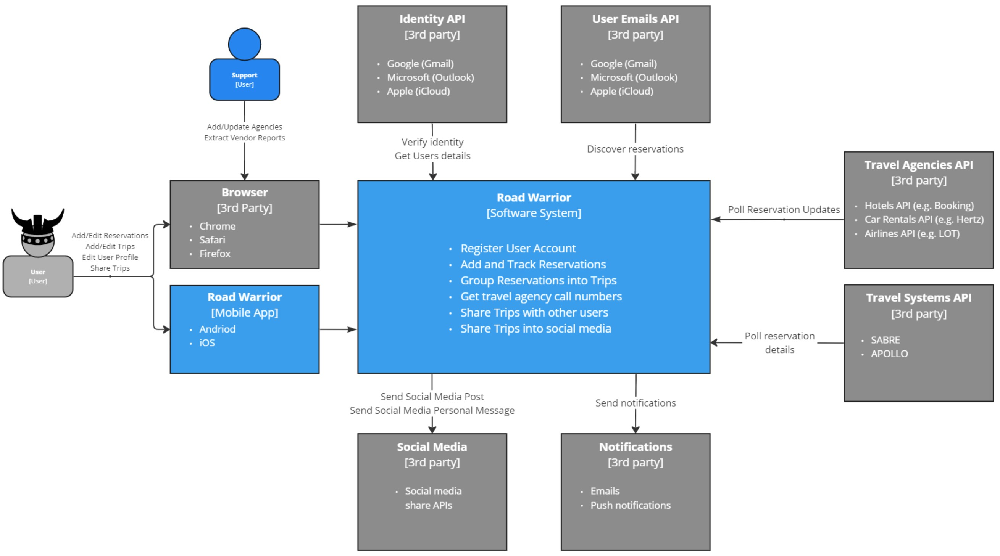
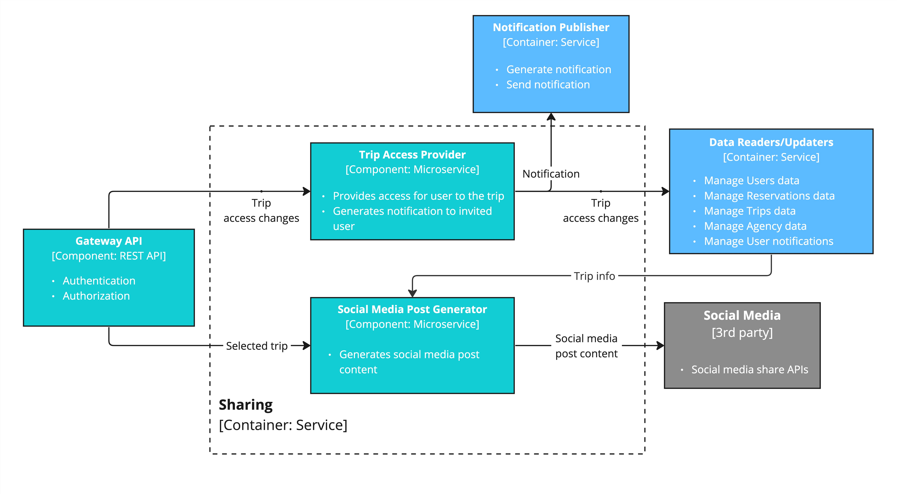

# Context viewpoint

> *Describes the relationships, dependencies, and interactions between the system and its environment (the people, systems, and external entities with which it interacts).*

## Level 1 - System Context

> *A System Context Diagram is a high-level visual representation that depicts a system or software application in its broader context. It illustrates how the system interacts with external entities, such as users, other systems, or data sources.*

As we can see the system has many-many integration points:
 * **User** that interacts with the system through the web application in the browser or through the mobile application.
 * **Support user** that does special actions in application such as maintaining available Travel Agencies or generating a vendor analytical report.
 * **Identity API** is used to verify the identity of the user who logs into the application. It also provides basic info about the user, that they agreed to provide during the registration.
 * **User Email API** provides the ability to discover new reservations by user email polling (if allowed by the user).
 * **Travel Agencies API** provides updates for reservations that were added by users or discovered in user email. E.g. Hotel, Airline or Car rental API.
 * **Travel Systems API** also provides updates and details for reservations. E.g. SABRE, APOLLO.
 * **Social Media** provides APIs to share the post in user's social media accounts.
 * **Notifications** are used to send user notifications such as emails or push notifications for mobile applications.

## Level 2 - Container diagram - Road Warrior

> *The Container diagram shows the high-level shape of the software architecture and how responsibilities are distributed across it. It also shows the major technology choices and how the containers communicate with one another*

In the first phase we want to enable users interaction with the system in general. To make this possible, we have introduced the following components:
- **Road Warrior UI**: This is a web application, with all static content hosted on a global Content Delivery Network (CDN).
- **Gateway API**: This component operates as a REST API, serving as a centralized entry point for all external incoming requests. Its responsibilities include user authentication and the orchestration of business logic across microservices.
- To verify user identity **Gateway API** interacts with **Identity API**.

The next phase involves enabling users to interact with reservations, trips, user profiles, and more. To achieve this, we're introducing the Data Readers/Updaters Container:
- **Data Readers**: These components provide data to the Gateway API and other microservices within the system.
They will implement search and filtering capabilities and the ability to retrieve full objects by their unique IDs.
- **Data Updaters**: These components are responsible for applying changes to objects in the database and ensuring their consistency and integrity are maintained.

Now, as we've enabled manual operations with objects, it's time to automate the tracking and discovery of reservations.
To achieve this, we've introduced the Trackers Container:
- **Emails Tracker**: This service is responsible for scanning users' email inboxes, searching for reservations, and extracting all the necessary information from them.
Its primary role is to discover new reservations.
It interacts with email via API, respecting user settings and permissions.
- **Reservation Trackers**: These services are responsible for ensuring that we have the latest reservation itineraries.
They maintain their internal state of active reservations to track changes.
- Any identified changes are then passed on to the **Data Updaters** for persistence in the database.

Once the system is set up to collect and consistently update information, it's essential to create a feature that enables the sharing of this information with both registered system users and external ones. To facilitate this, we're introducing the Sharing and Notification Containers:
- **Sharing**: This component empowers users to share their Trips and Reservations with others within the app or create posts for sharing on their preferred social media platforms. To ensure a seamless user experience, it will interact with Social Media Aggregators, which will be specified later.
- **Notification Publisher**: This component takes on the responsibility of informing users about significant changes to their reservations and notifying them when someone shares content with them within the app.
It achieves this by interacting with external Notification APIs to deliver emails and push notifications to mobile apps.

The final but equally essential function is the ability to generate analytical reports. To accomplish this, we introduce the Reporting Container:
- **Analytical Reports Generator**: This service is responsible for extracting data through the Data Reader and producing two distinct types of reports. The first type consists of monthly Vendor reports, which are accessible to Support personnel and can also be shared with external parties. The second type of report is the annual user report, which offers insights into user travel history for the previous year. This functionality empowers data-driven decision-making and enhances the overall system's capabilities.

## Level 3 - Containers

> *The Component diagram shows how a container is made up of a number of "components", what each of those components are, their responsibilities and the technology/implementation details.*

### Level 3 - Container - Emails Tracker

Implementation of Email tracker based on the use of the Compacted topics. Emails that are used to track new reservations are registered by microservice `Email Tracking List Editor` into compacted topic `Email Addresses`. Each email from the topic is processed by the `Emails Tracker` microservice, which includes:
1. polling new emails compared to a previous state (if any),
2. store new emails to parse to `Unparsed User Emails` topic,
3. store the last processed email timestamp back to the `Email Addresses` compacted topic.

That way on each new iteration the `Emails Tracker` microservice will be able to identify and process new user emails.

Emails from the `Unparsed User Emails` are captured by the microservice `Emails Parser` which parses the content of the user emails to discover new reservations. Found new reservations stored in the `Email Reservations` topic. The microservice `Reservations Updater` processes reservations from the topic:
1. Stores reservation info in `Reservations Data Reader/Updater` service,
2. Sends an update to the `Notification Publisher` service.

### Level 3 - Container - Reservation Trackers

Implementation of `Reservation trackers` based on the use of the Compacted topics. The reservations that should be tracked are picked by the `Reservation Tracker` microservice and sent to one of the Compacted topics depending on the reservation type. Each type of the topic being processed by Tracker for a specific reservation type and sent to the external Travel System or Travel Agency API for reservation updates. Any existing update stored back to the corresponding Reservations compacted topic and being processed by the `Reservation Updater` microservice. It updates the reservation information in the system by:
1. Sending the Reservation update to the `Reservation Data Reader/Updater` service,
2. Sending the Reservation update to the `Notification Publisher` service to notify the user about the change.

### Level 3 - Container - Notification Publisher

All notifications from different originators are sent into the topic `Incoming Notifications`. They are picked by the `Notifications Registrator` and filtered according to the Notification settings for each user. In case the user disabled one of the notification types in the settings - the corresponding notification will be filtered out by the `Notifications Registrator` and not sent to the next step. All notifications after filtering are sent to the `Notifications To Send` topic. Notifications from that topic are being processed by the `Notifications Sender` microservice.

There are three possible ways to deliver notification to the user:
1. Push notification to the mobile application
2. Email notification
3. Notifications widget in the web or mobile application

The first two are implemented using the 3rd party API for sending mobile-native push notifications and emails. The last one is implemented by sending the notification to the `Notifications Data Reader/Updater` service.

### Level 3 - Container - Sharing

Sharing container provides two options for a user to share information about his trips:
1. Create and share in the user's social media profile a post with high-level information about the user's trip
2. Invite another user to the trip with a specified access level (viewer/co-traveler/owner).

Both of the sharing actions start from the user's request in the RoadWarrior app. The first scenario is controlled by the `Trip Access Provider` microservice, which does two actions:
1. Sends trip access changes to the `Trip Data Reader/Updater`.
2. Initiates notification via `Notification Publisher` to the invited user about granted access to the Trip.

The second scenario is being processed by the `Social Media Post Generator` microservice. It gathers the trip info from the `Trip Data Reader/Updater` and combines post content from it. Generated post content sent by microservice to the `Social Media` 3rd party API, provides an ability to share posts on the user's behalf in it's social media account.

### Level 3 - Container - Analytical Reports Generator

There are two supported types of reports in the system:
1. Vendor reports with aggregated analytical information about users' travel behavior.
2. User annual reports with travel statistics.

Generation of reports of each type implemented by separate microservices: `Vendor Report Generator` and `User Report Generator` respectively. Both microservices read all necessary data from `Data Readers` services and send generated reports to the requester through `Gateway API`.

