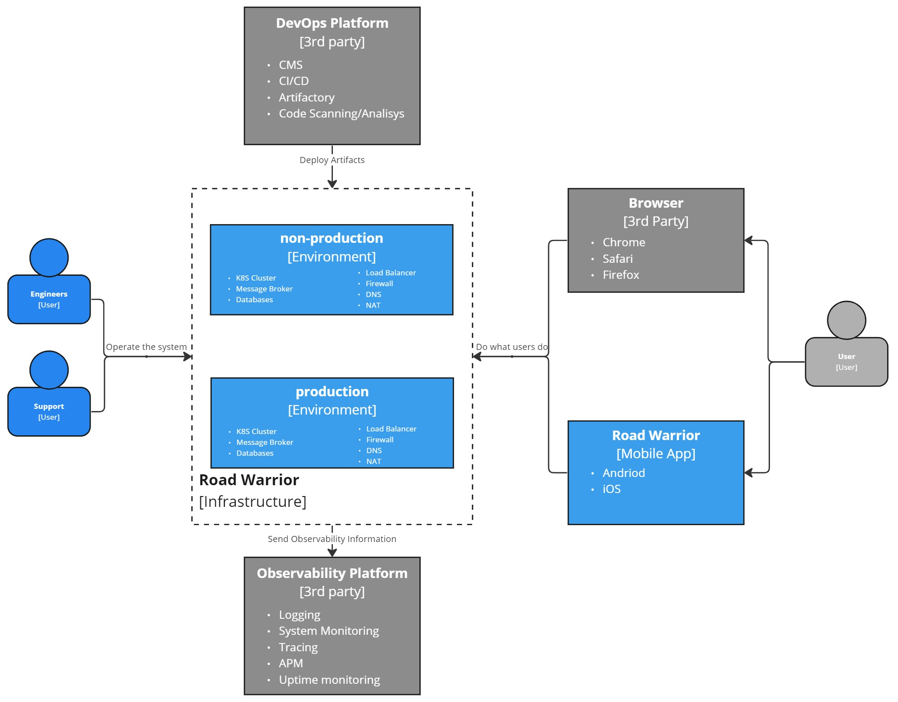
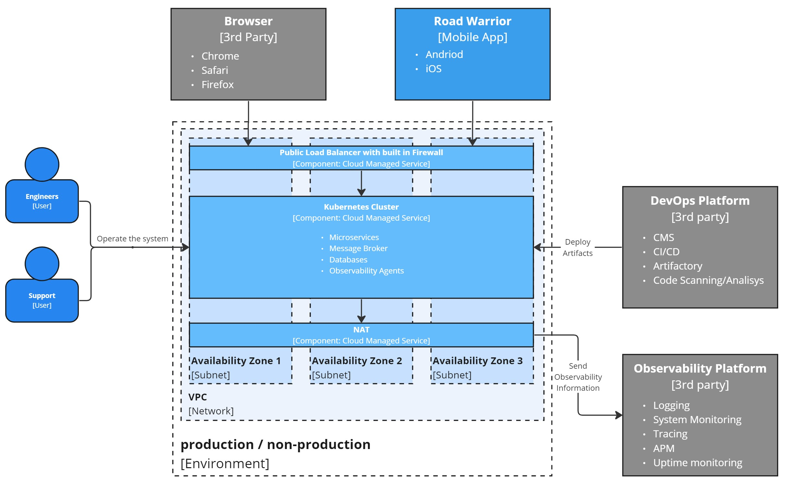

# Deployment Viewpoint
> *Describes the environment into which the system will be deployed, including capturing the dependencies the system has on its runtime environment.*

We plan to establish two stable environments—one for production workloads and another for non-production tasks. Both will be created and managed through Infrastructure as Code (IaaC). While setting up these environments may take some time initially, they will substantially simplify future changes and enhance overall stability in the long run.

Our strategy involves leveraging third-party DevOps and Observability platforms to avoid the need to dedicate time to setting up development and monitoring tools. This approach allows us to focus more on our core development and operational tasks while benefiting from the capabilities offered by established platforms.

## Environment

From a deployment perspective, our primary concern is achieving an exceptionally high availability SLA of 99.99%. To meet this stringent standard, we must meticulously design our environments. Here are the main components of these environments:
- **Network**: To attain the desired SLA, we propose initially employing multi-zone deployment within a single region. We recommend against multi-region deployment due to added network costs for inter-region communication. Access to the network should be facilitated through Public Load Balancers with built-in firewalls capable of handling external threats and internal failures.
- **Microservices Runtime**: We strongly advocate utilizing Kubernetes as the resource manager for managing microservices efficiently. Kubernetes has built-in auto scalers and internal load balancers, making it well-suited for meeting our scaling and elasticity requirements.
- **Message Broker**: To support an event-driven architecture effectively, employing a scalable message broker is imperative. We recommend using Kafka, a widely recognized and industry-tested software for handling large-scale event streaming. We propose deploying self-hosted open-source Kafka within the Kubernetes environment. This approach helps with cost savings in the initial project phases and aligns with our scalability goals.
- **Database**: To achieve a highly scalable and available system while keeping performance at exceptional level, opting for a NoSQL clustered database is essential. We recommend using self-managed MongoDB for reasons similar to the Message Broker's. Self-management within Kubernetes enables us to control costs while ensuring robust database performance and availability.

By meticulously designing and implementing these components, we aim to create symmetrical environments for both production and non-production workloads, ultimately meeting our demanding SLA requirements and ensuring the stability and resilience of our system.

