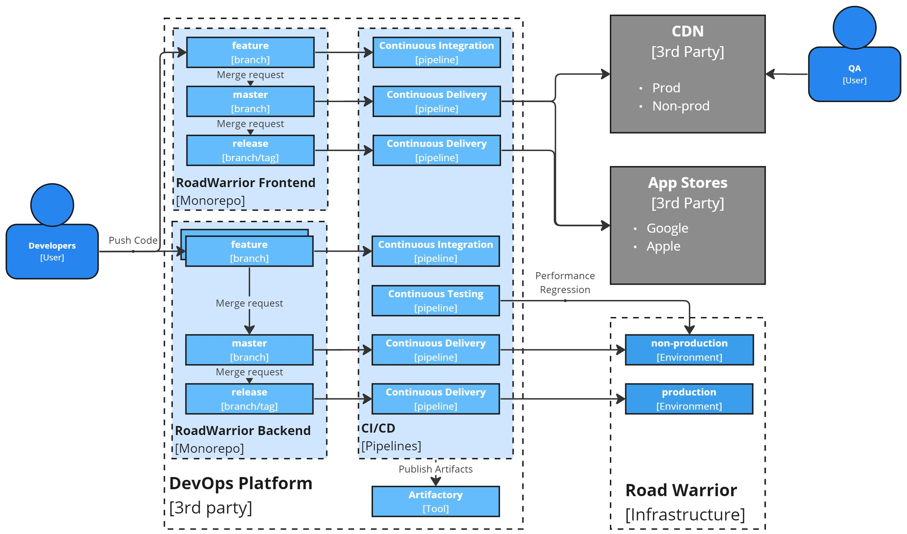

# Development Viewpoint
> *Describes the architecture that supports the software development process.*

When designing a software architecture, it's crucial to consider how it will be developed. 
Evolvability, the ability to make changes over time, is a critical non-functional requirement. 
A well-structured development process, enhanced by automation, enables quick changes while maintaining product quality at a reasonable level.
There are several decisions to make regarding the development process:
- **Code Storage and Structure**: Determine how code will be organized and stored within your project, ensuring it is well-structured and easy to manage.
- **Code Merge Strategy**: Decide on the approach for combining code contributions from multiple team members or branches, ensuring a smooth integration process.
- **Automation vs. Manual Processes**: Identify which parts of the development workflow should be automated to streamline tasks and reduce manual effort while considering when manual intervention may still be necessary for quality assurance.
- **DevOps Platform**: Choose a provider that will supply all necessary dev tools.  
 
## Code structure

In contemporary software development, there are two primary methods for handling code:
- **Monorepo** is typically preferred for minor to medium-sized projects or those with closely interconnected components. It streamlines the development process, enhances collaboration, and simplifies dependency management. Monorepo is also a common choice for organizations that strongly emphasize code sharing and maintaining consistency.
- **Multirepo**, on the other hand, is a suitable approach for larger projects with components that operate independently and have loose connections. This approach offers more flexibility and independence to teams working on various aspects of the project. Multirepo is often favored in scenarios involving microservices architectures and organizations that prioritize component isolation.

We will begin our app with two mono repositories: one for the frontend (covering both web and mobile apps) and another for all the backend microservices. This approach allows us to efficiently manage development in the early stages and maximize code reuse. It's important to note that a well-structured monorepo can always be divided into smaller repositories if needed.
To ensure flexibility and minimize direct code dependencies, we'll implement a strategy where code sharing occurs through libraries or plugins managed as separate artifacts. This way, we maintain modularity and can quickly adapt to changing requirements in the future.

## Code Merge Strategy

Numerous merge strategies exist, each tailored to specific scenarios. The table below offers guidance on when to apply each method.

Due to constraints on our mobile app release schedule, we've opted to implement **GitLab Flow** for both frontend and backend development. This choice aims to streamline joint releases and simplify our overall workflow.

## GitLab Flow

GitLab Flow is centered around a primary branch, usually called main or master, and it involves creating release/hotfix branches or release tags. Here's the key concept: developers work on feature branches, testing their changes locally. Once the code is ready, it's merged into the main branch, triggering automated deployment to a non-production environment for integration, regression, and performance testing. When it's time to release, a release branch/tag is created, automatically initiating the production deployment process.

## Automation vs Manual

There are several critical processes where automation plays a crucial role:
- **Continuous Integration of Feature Branches**:
  - This step simplifies and expedites feature testing and code review.
  - Automation ensures that security checks, adherence to style guides, and successful execution of unit test cases are verified.
- **Continuous Delivery for Main and Release Branches**:
   - Automation is vital from the project's outset for modern microservices applications with complex dependencies.
   - It guarantees that deployments occur accurately and efficiently, considering the intricate topology and dependency tree.
- **Continuous Testing**:
  - Automating test cases for the application offers consistency and substantial time savings during the release process.
  - It includes both Regression and Performance testing, which collectively enhance time-to-market significantly.

> For our app we decided to use full testing automation for the backend, while keeping manual QAs for frontend. 
> Frontend testing automation is very sensitive and time-consuming process, while app is developing it will increase our time to market.
