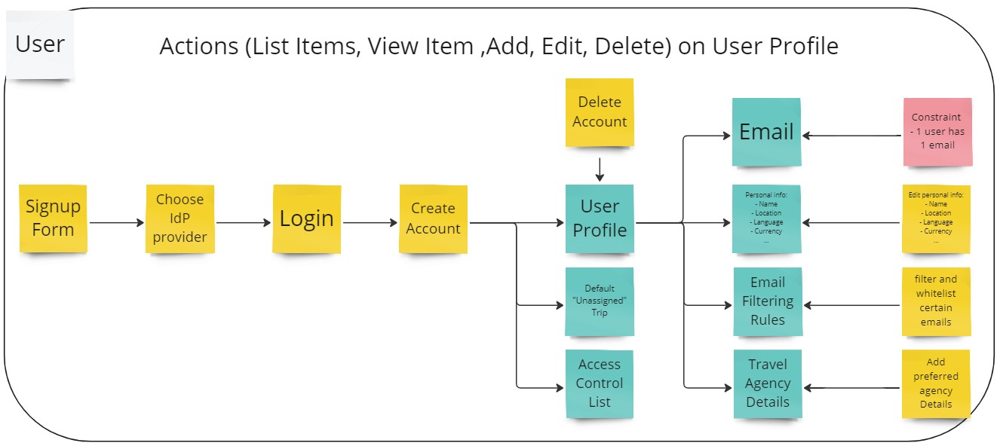
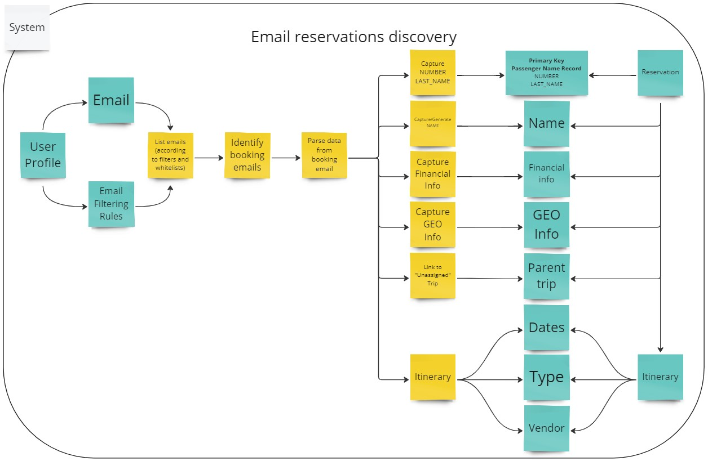
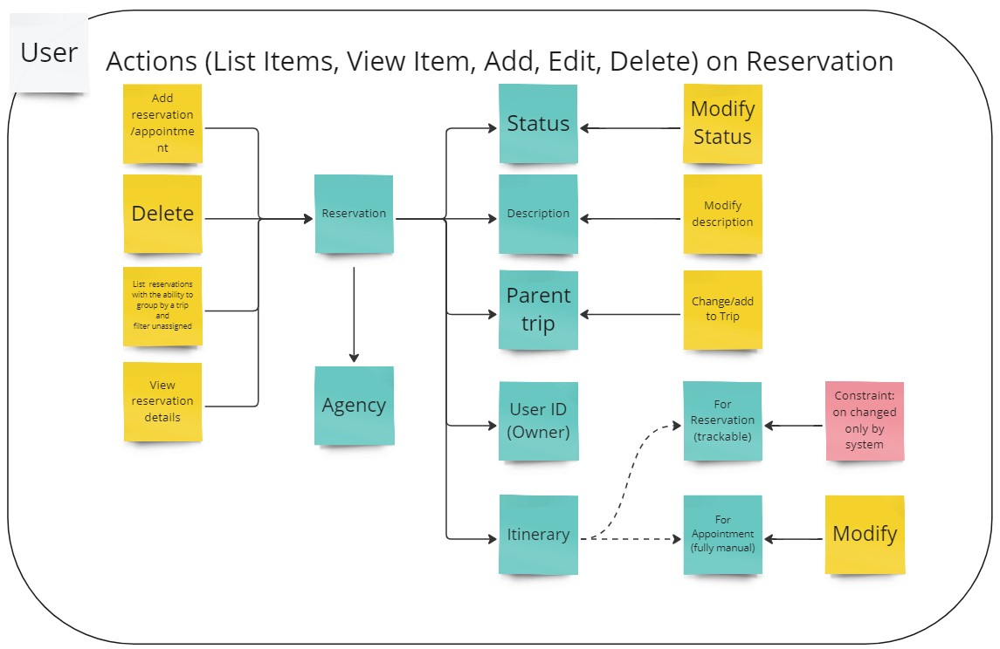
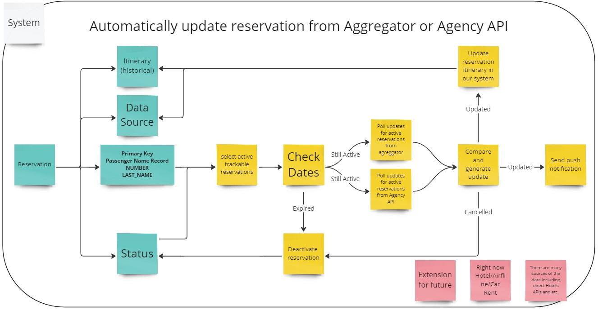
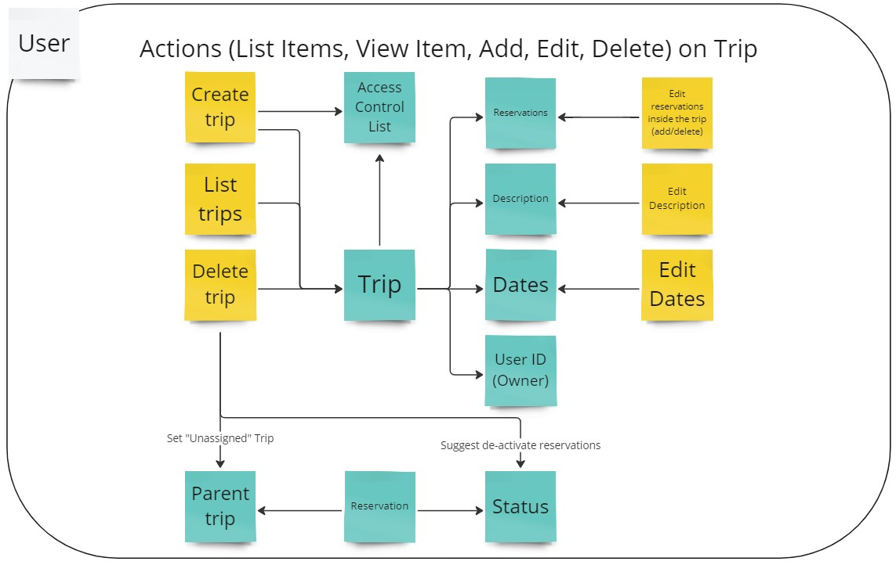
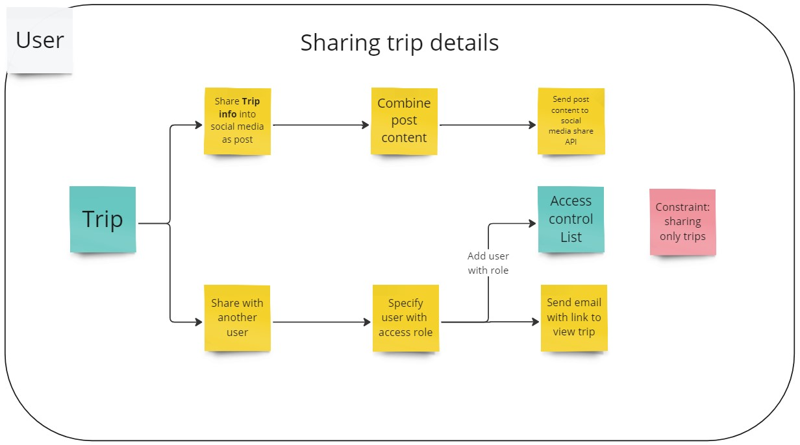
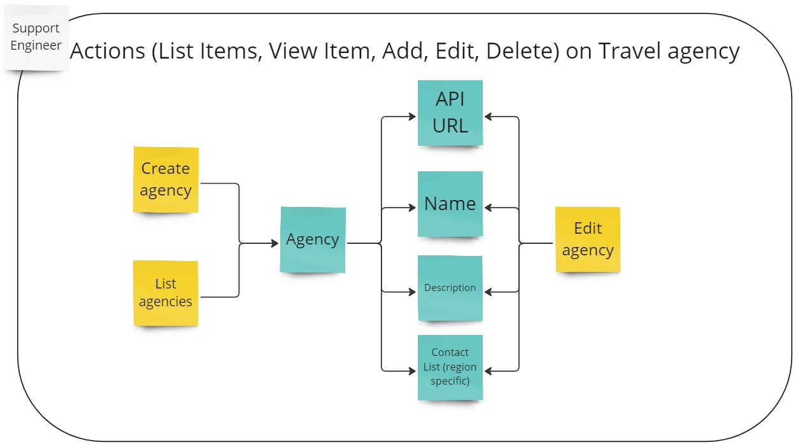
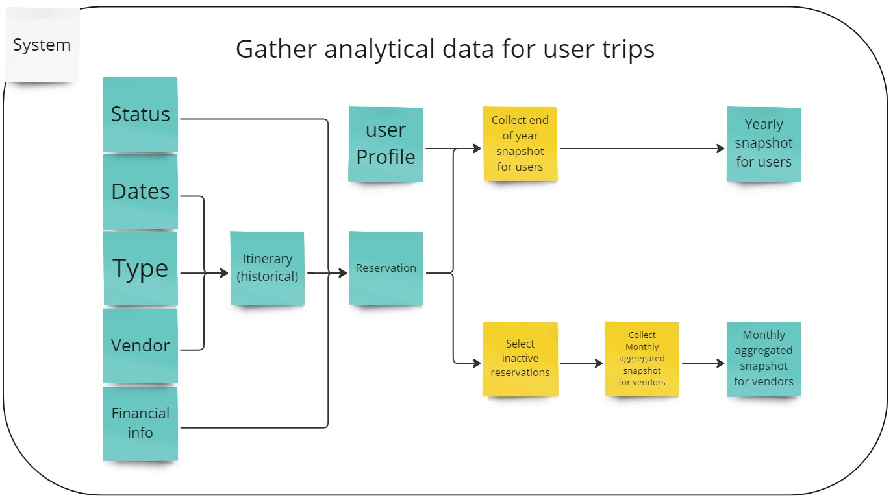

# Functional Viewpoint
> *Describes the system’s functional elements, their responsibilities, interfaces, 
> and primary interactions*

Based on functional requirements we identified main flow our application should support. 
Of coarse there are additional flows but all of them are connected to main one in some way.

**Legend for diagrams**

- **Actor**: User or System 
- **Function**: Action performed by Actor
- **Data Element**: May represent an object or it's attribute
- **Constraint**: Functional limitation introduced to simplify system

## Table of Contents

<!-- TOC -->
* [Functional Viewpoint](#functional-viewpoint)
  * [Main Flow](#main-flow)
  * [Work with User Profile](#work-with-user-profile)
  * [Email reservations discovery](#email-reservations-discovery)
  * [Work with reservations](#work-with-reservations)
  * [Reservations tracking](#reservations-tracking)
  * [Work with trips](#work-with-trips)
  * [Sharing Trips](#sharing-trips)
  * [Work with travel agencies](#work-with-travel-agencies)
  * [Analytical reports](#analytical-reports)
<!-- TOC -->

## Main Flow

The primary flow of our application begins with user registration. Once a user successfully logs in, they have two main options: they can manually enter reservations or set up an email integration to automatically discover reservations in their inbox.
When a reservation is added to the system, it initiates a tracking process using partner APIs to monitor and update its details continuously. Any changes detected are then saved within our system. Users are promptly notified of these changes through push notifications on their mobile devices, email alerts, or pop-up messages on the web.
Since users may have multiple reservations, we provide a feature allowing them to group these reservations into a "Trip." These trips can be viewed by the user or shared via social media as public posts or within the app to another user.

## Work with User Profile
Our system will not store user/password information; instead, it will rely entirely on one of the leading providers, Google, Apple, or Microsoft, for user authentication. Using one of these providers for authentication will simplify the process of integrating email services.

> **Important constraint**:  we recommend that one user account be associated with one email integration. In the future, we may consider allowing multiple email addresses to be associated with a single user profile, but for now, it's one user, one email integration.

Once a user has registered, they will have the following options:
- **Enter Personal Information**: Users can provide personal information as needed.
- **Set Email Filtering Rules or Disable Integration**: Users can configure email filtering rules or completely turn off the email integration feature.
- **Choose Preferred Travel Agency**: Users can select their preferred travel agency from the available options.
- **Delete Account**: If needed, users can delete their account.

To simplify access control, we've chosen to handle it exclusively at the Trip level. 
However, since reservations can exist without a trip, here's what we'll do during profile creation:
When a user creates their profile, we'll automatically create an "unassigned" trip and grant the user access right away. 
Any new reservations they make will automatically be placed under the "unassigned" trip, ensuring the user can access them without any extra steps.

## Email reservations discovery

One of the app's standout features is automatic reservation discovery via emails, designed to save users significant time and greatly enhance the app's value proposition.
Within this function, we aim to extract the following Information from emails:
- **Booking Number/Passenger Name Record**: This is a primary key to uniquely identifying reservations within Travel Agency/System APIs.
- **Personal Information**: This includes passengers' first and last names.
- **Financial Information**: We will capture the cost of the booking.
- **Geographical Information** pertains to arrival and departure details for flights and location information for hotels and car rentals.
- **Itinerary Details**: This category encompasses booking-specific information such as dates, times, travel type, travel agency, and more.

As part of this process, all extracted reservations will be automatically grouped under the "unassigned" Trip, ensuring users can manage their newly discovered reservations effortlessly.

## Work with reservations

> **Reservation** is a user- or automatically created object used to store all reservation details.

We will allow users to manually input their reservations to accommodate situations where not all reservations can be automatically added. 
We recognize two distinct reservation types:
- **Regular (Trackable) Reservations**: These are bookings made through airlines, hotels, and car rentals that our system supports. 
These reservations can be automatically tracked and managed within the app.

- **Appointment Reservations**: This reservation type is entirely manual and serves two prominent use cases. 
  - Firstly, it caters to entirely user-specific events, such as dinner plans with friends or tickets to the opera. 
  - Secondly, it covers all trackable reservations not currently supported by our system, such as train tickets. This approach ensures that users can fully utilize the power of trip management without significant inconvenience, regardless of the reservation type.

During reservation creation, our system automatically identifies and links the most suitable travel agency with each reservation. 
This functionality will enable us to display a "HELP" button on each reservation, providing users with easy access to the contact details of the associated travel agency.

## Reservations tracking

The app's standout feature is its ability to track reservation changes and promptly notify users of updates. 
We will integrate with travel agency and travel aggregator APIs to achieve this, ensuring all essential updates are noticed. 
This integration will provide users with real-time information and enhance their travel planning experience by keeping them informed and up-to-date with any changes to their reservations.

> **Important Notes**:
> - We support only Hotel, Airlines, Car Rental reservations tracking        
> - We must ensure we are able to extend this in future

## Work with trips

> **Trip** is a user-created object used for logical grouping of reservation items.

An important and valuable feature of the app is the ability to organize reservations by grouping them into Trips. This functionality streamlines reservation management and enhances organization. Each Trip can be customized with a description and its own start and end dates, allowing users to structure their travel plans.
If a user deletes a Trip, the app will seamlessly handle the transition by automatically reassigning all associated reservations to the "unassigned" Trip. Additionally, the app will suggest deactivating these associated reservations, effectively stopping their tracking.

## Sharing Trips

> **Access Control List** is an object used to authorize user to a trip.

To expand the app's user base, we are implementing convenient ways to share information both within and outside the app. 
Users will have two options for sharing their Trips with others:
- **Social Media Post**: With a simple button click, the app will generate a post containing your trip details and direct you to your chosen social media platform. 
The specific social media platforms supported in the initial release will be determined later, providing users with flexibility in sharing their travel experiences.

- **Sharing Inside the App**: Users can share their trip details with another user by entering their email address. 
They can choose to share only trip itself or including all reservations assiciated to a trip.
This action will generate a link and send it via email, allowing the recipient to access the specific trip via a web or mobile interface. 
If the recipient does not have an account, they will be prompted to create one by logging into the app using their Google, Apple, or Microsoft ID. 
This feature encourages users to bring more people into the app, fostering community and increasing its user base.

## Work with travel agencies

> **Travel Agency** is support-created object used to fill in agency details including contact info for HELP button.

At the moment, our approach involves the manual maintenance of a list of travel agencies with the assistance of our support team. 
While we are actively exploring ways to automate this process in the future, the current focus is on ensuring the app's functionality.
The inclusion of travel agencies is a crucial feature of the app. 
During reservation creation, our system automatically identifies and links the most suitable travel agency with each reservation. 
This functionality will enable us to display a "HELP" button on each reservation, providing users with easy access to the contact details of the associated travel agency.

## Analytical reports

Analytical capabilities within the app serve two essential purposes:
- **Annual User Reports**: One of the app's requirements is to generate annual reports summarizing a user's trips. This functionality could expand into a more comprehensive export feature or even evolve into a dashboard presenting aggregated insights about a user's trips within the app. 
- **Monthly Travel Agencies Reports**: The information we collect has the potential to be of great interest to travel agencies. 
It can become a significant monetization opportunity. 
To ensure user privacy and data security, we will carefully remove any user or reservation-specific information and provide only aggregated data in these reports. 

