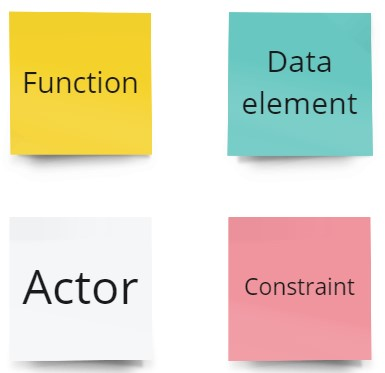
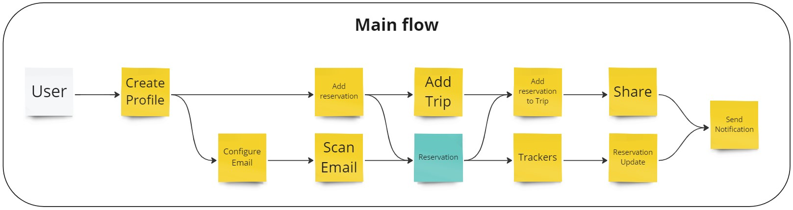

# Functional Viewpoint
> *Describes the system’s functional elements, their responsibilities, interfaces, 
> and primary interactions*

Based on functional requirements we identified main flow our application should support. 
Of coarse there are additional flows but all of them are connected to main one in some way.

###Legend for diagrams

- **Actor**: User or System 
- **Function**: Action performed by Actor
- **Data Element**: May represent an object or it's attribute
- **Constraint**: Functional limitation introduced to simplify system
## Main Flow

The primary flow of our application begins with user registration. Once a user successfully logs in, they have two main options: they can manually enter reservations or set up an email integration to automatically discover reservations in their inbox.
When a reservation is added to the system, it initiates a tracking process using partner APIs to monitor and update its details continuously. Any changes detected are then saved within our system. Users are promptly notified of these changes through push notifications on their mobile devices, email alerts, or pop-up messages on the web.
Since users may have multiple reservations, we provide a feature allowing them to group these reservations into a "Trip." These trips can be viewed by the user or shared via social media as public posts or within the app to another user.

## User Profile Actions
