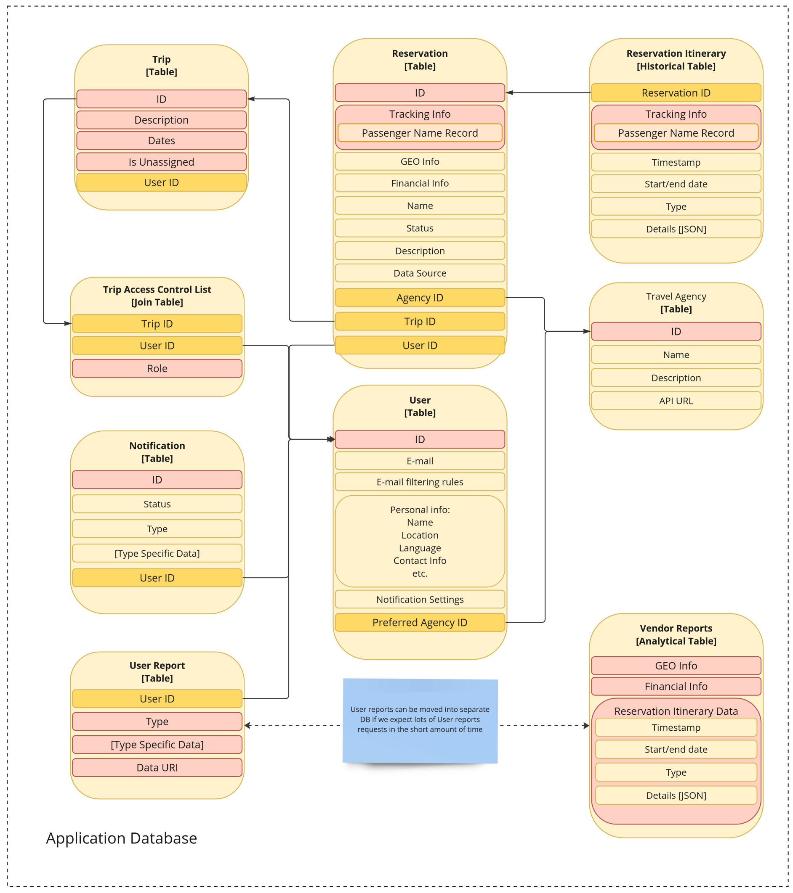

# Information Viewpoint

# TODO

- refactor user-reservation relationship. the owner relation is NOT done through
  the access control table, since it's a special case.
- Update image when doc is approved
- update depths of headers to correct values
- cross-link mentioned entities and markdown headers
- dots in the ends of list entries - pick single style
- pick a convention on mentioning ID for the links

# Purpose

This document describes Data Schema for the solution and provides rationale for
decisions taken.

# Overview

Functionally, the application provides several feature groups, including:

- User Management
- Reservation Tracking
- Access Control
- Report Generation
- User Notification

Data Schema mirrors that separation

TODO: add feature/entity matrix maybe?

# Entities

## User

The User entity represents the end user of the app and encompasses all
information specific to a user.

### Decisions
- All data is consolidated within a single table, featuring dynamic schema
  fields and accommodating multiple records. This approach optimizes
  performance, facilitates extensibility, and is applicable given that the data
  in question remains unaltered in critical business transactions.

### Fields:
- ID: This serves as a surrogate primary key, prioritizing performance and
  simplifying GDPR compliance procedures.
- E-mail: The user's email, utilized for authentication as well as reservation
  discovery and tracking purposes.

- E-mail Filtering Rules: These configurations define the scope of scraped
  emails, enhancing privacy and performance.

- Personal Info: This section encompasses user-specific personal data.
  - Name: Facilitates polite user addressing.
  - Location: Records the user's home address, essential for addressing
    emergency issues, also used for scoping vendor analytical reports.
  - Language: Indicates the preferred UI language.
  - Contact Info: Crucial for emergency cases and prompt issue resolution.
- Notification Settings: This field encompasses preferences regarding
  notification frequency, importance, and delivery method, enhancing user
  convenience.

### Outbound Links
- Preferred Agency: Identifies the travel agency designated for quick issue
  resolution.

### Inbound Links
- Shared Trips (via the "Trip Access Control List" join table): These are trips
  shared with the user by other users, primarily utilized for authorization and
  access control.
- Owned Trips (directly linked by `Trip`'s Owner ID): Refers to trips created
  and owned by the user.
- Reservations: Records of reservations created and owned by the user, primarily
  for authorization purposes.
- Notifications: Essential for tracking read receipts.
- User Reports: These reports are specifically intended for the user, enabling
  recipient tracking.

## Reservation

The Reservation entity represents an individual trip event, optionally
identifiable and traceable within travel agency reservation management systems.

### Decisions
- Utilization of a Surrogate Key instead of a natural Personal Name Record key
  enhances performance, streamlines GDPR compliance, and allows for the
  management of reservations not available for tracking in other systems (e.g.,
  privately arranged car transfers or hotel stays).
- To mitigate the potential load of itinerary updates, core itinerary data is
  stored in a separate data collection. Please refer to ``Reservation Itinerary`
  for more details.

### Fields
- ID: Surrogate key for unique identification.
- Tracking Info: Natural key comprising personal details used to retrieve
  reservation details from reservation tracking systems.
- GEO Info: Contains information about the geographical locations involved in a
  reservation. This field is dynamic to facilitate extensibility and support
  various reservation types, benefiting user convenience and analytical
  purposes.
- Financial Info: Contains the financial details of the trip, used for
  analytical purposes in user and vendor reports.
- Name: The in-app display name of the trip.
- Status: An enumeration indicating the reservation's lifecycle (e.g., active
  (tracked), cancelled (by vendor), removed (by the user), finished (due to
  passage of time), etc.).
- Description: A free-form section for users to provide additional information
  about the reservation.
- Data Source: Records information about where the reservation was discovered,
  used primarily for investigation purposes.

### Outbound Links:
- Agency ID: Identifies the travel agency responsible for managing the
  reservation, used for issue resolution and data tracking.
- Trip ID: Links the reservation to the corresponding trip, facilitating
  grouping. Please refer to Trip for further information.
- UserID: Identifies the creator and owner of the reservation, utilized for
  authorization purposes.

### Inbound Links
- Reservation Itinerary: Contains historical versions of the trip itinerary
  details, extracted to a separate collection for enhanced performance.

## Trip

The Trip entity represents a collection of reservations, providing a convenient
grouping. Additionally, trips can be shared with other users, allowing for
controlled data access in the sharing feature.

### Decisions
- Each user possesses an "Unassigned" trip service containing all reservations
  that have not yet been assigned. This approach streamlines the process of
  working with reservations.
- The user who owns the trip is still tracked through a direct reference,
  simplifying core authorization.

### Fields
- ID: Unique identifier for the trip.
- Description: Provides a space for users to include additional information
  about the trip.
- Dates: Indicates the start and end dates of the trip. This information is used
  for convenience and facilitates automatic grouping of reservations.
- Is Unassigned: A special flag to mark reservations that have not been
  assigned. Each user should have exactly one unassigned trip.

### Outbound Links
- Owner: Identifies the user who created and owns the trip. This information is
  used for authorization purposes.

### Inbound Links
- Users (via the "Trip Access Control List" join table): Contains a list of
  users and their corresponding roles granted for the trip.

## Trip Access Control List

The Trip Access Control List entity manages user access to trips that have been
shared by other users. Its sole purpose is for authorization.

### Fields
- Role: This field is an enumeration offering various access levels for the
  trip. Access levels range from "full read access" used for co-travelers, to
  "trip dates and locations" for cases where data is shared with a broader or
  less trusted audience.

### Outbound Links
- User: Identifies the user for whom the access role applies.
- Trip: Specifies the trip to which the access control rule applies.

## Travel Agency

The Travel Agency entity encompasses information related to reservation tracking
and issue resolution.

Decisions:
- Data acollection is maintained up to date by support engineers. This is
  acceptable for the MVP stage of the servicd.

### Fields
- ID: Unique identifier for the travel agency.
- Name: Name of the travel agency.
- Description: Provides information about the travel agency, utilized for
  internal purposes and presentation to the user. This section also contains
  contact information.
- API URL: The URL used to track reservation updates for this agency.

### Inbound Links
- User: Identifies the user who prefers this travel agency for issue resolution.

## Notification

The Notification entity logs the delivery of app notifications to users.

### Fields
- ID: Unique identifier for the notification.
- Status: Indicates whether the notification has been delivered or not.
- Type: Enables identification of different interpretations in code and provides
  richer content for the user.
- Type Specific Data: A dynamic field containing data to be presented to the
  user.

### Outbound Links
- User: Identifies the intended recipient of the notification.

## User Report

The User Report entity represents datasets collected for presentation to the user, such as an annual report.

### Decisions
- In scenarios of high peak loads, reports can be relocated to a separate
  analytical database to enhance performance.

### Fields
- ID: Unique identifier for the user report.
- Type: Identifies different types of reports in the code and provides richer
  content for the user.
- Type Specific Data: Contains additional information specific to the report
  type, interpreted by the system.
- Data URI: A link to the actual data of the report. This allows for storage in
  a more performant and suitable system, such as BLOB storage.

# Outbound Links

- User ID: Identifies the intended recipient of the report.

## Vendor Report

The Vendor Report entity represents a dataset record of aggregated analytical
data generated for vendors, such as travel agencies. All the data in the dataset
serves analytical purposes.

### Decisions:
- To enhance performance during high peak loads, reports can be relocated to an
  analytical database.
- This document focuses solely on data storage. The data export feature is not
  covered and should be discussed further with the product owner.
- The primary key is designed to anonymize personal information while still
  providing useful granularity for the consumer.
- The provided stats are for illustrative purposes and require rigorous
  refinement in collaboration with product owners.

### Fields

Primary Key: Scope of the statistical data in the record
- Time period: Specifies the date range for the scope of report stats.
- Agency: Acts as an agency filter for reservations.
- User Geo Region: Indicates the country or state-wide range of user's home locations.
- Reservation Geo Region: Identifies the country or state-wide range of reservation locations.

Stats:
- Financial Stats:
  - Average per-user bill
  - Total money spent
- Updates Stats:
  - Re-scheduling Rate
  - Replacement Rate
  - Cancellation Rate

# Changelog

## Revision 4

Rewrite All entity sections with help of chatgpt.

## Revision 3

Rewrite All entity sections with "why" question in mind.

## Revision 2

Rewrite User, Resrvation sections with "why" question in mind.

## Revision 1

Draft information for all entities added.

## Revision 0
- Initial

