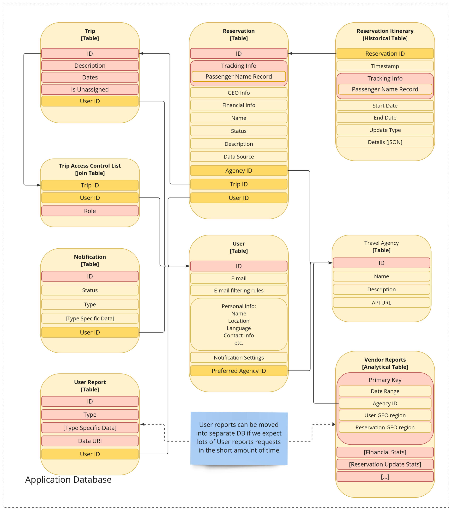

# Information Viewpoint

# TODO

- refactor user-reservation relationship. the owner relation is NOT done through
  the access control table, since it's a special case.
- Update image when doc is approved

# Purpose

This document describes Data Schema for the solution and provides rationale for
decisions taken.

# Overview

Functionally, the application provides several feature groups, including:

- User Management
- Reservation Tracking
- Access Control
- Report Generation
- User Notification

Data Schema mirrors that separation

# Glossary

TODO: pulling vs discovering

# Entities

# User

User table contains all the information that is related to specific user.
The data is denormalized, and dynamic fields with multiple records are present
in the table. This decision provides better performance and is viable since
the data in the user table is not participating in any busines-critical
transactions.

## Fields:

- ID - primary key
- E-mail - the e-mail that user registered with and from which the reservations
  will be discovered
- E-mail filtering rules - configuration of search terms and other filters to
  use when crawling for e-mails. The field has a fallback value set up to match
  all possible travel-related emails
- Personal Info - User-related personal data
  - Name - for polite user addressing
  - Location - home address of the user, for emergency issue resolution
  - Language - preferred UI language
  - Contact Info - for emergency cases and issue resolution
- Notification settings - preferences regarding frequency, importance and
  delivery method for the in-app notifications.

Inbound Links
- Preferred Agency ID - travel agency that should be used for quick issue
  resolution

Outbound Links
- Trips (Through "Trip Access Control List" join table)
- Reservations
- Notifications
- User Reports

## Reservations

This entity represents single trip event, (optionally) ident and
trackable in other travelling systems.

Table has Surrogate Key for performance and ability to manage reservations that
are NOT available in any other tracking system (e.g. privately agreed transfer
or hotel stay).

Since the main purpose of the application is to provide the user with updates on
trip details, the core itinerary data that is monitored for updates is located
in a joined table called `Reservation Itinerary`.

### Fields
- GEO Info - information about the geographical locations involved in a trip.
  Field is dynamic to allow for greater flexibility
- Financial Info - financial details of the trip. Used for analytical purposes
  for user and vendor reports.
- Name - in-app display name of the trip
- Status - for tracking active, cancelled, user-removed etc state of a
  reservation.
- Description - free-form description of the reservation. A space for user to
  specify additional information.
- Data Source - [TODO] Indication on where the reservation should be tracked. OR
  abut where it was discovered.

### Outbound Links:
- Agency ID - travel agency managing the reservation. Used to resolve issues and
  for data tracking
- Trip ID - trip that the reservation belongs to, Trips are used for grouping,
  see Trips chapter.
- UserID - The user that created and is owning the reservation. Owner can
  perform updates to reservation datails, status, and share it with users with
  other roles.

### Inbound Links
- Reservation Itinerary - historical versions of the trip itinerary details. see
  Reservation Itinerary for more

## Trip

Trip entity is used to group multiple reservations for convenience. Also trips
can be shared with other users, Allowing them to view information on contained
reservations with differen granularity according to role. See more on sharing in
Trip Access Control List chapter.

Each user has a special "Unassinged" trip ontaining all not-yet-assigned
reservations. This trip is used to simplify access control to such reservations
and unify the flow of working with them.

### Fields
- ID
- Description - A space for user to specify additional information.
- Dates - start and end date of the vacation. For convenience purposes and
  easier automatic grouping of reservations.
- Is Unassinged - Special flag to mark the unassigned reservation. Only one per
  each user should exist.

### Outbound Links
- Owner ID - User that created and is owning the trip. Owner has full access to
  edit the trip as well as the reservations contained.

### Inbound Links
- Users (Through "Trip Access Control List" join table) - list of users and
  corresponding roles they have been granted for the trip.

## Trip Access Control List
Table tracks access of users to the trips that have been shared with the by
other users.

### Fields
- Role - enumeration with different access levels for the trip. Levels of access
  range from "full read access" used for co-travellers to "trip dates and
  locations" for case of sharing data with wider and/or less trusted audiences,

### Outbound Links
- User - the user for whom the role applies
- Trip - the trip to which access applies

## Travel Agency

Reverence Data collection that contains information about all supported travel
agencies. Used for tracking configuration and user quick issue resolution.

### Fields
- ID
- Name
- Description - info about the travel agency to be presented to user. Contains
  contact information.. TODO: mention the contact info explicitly and
  separately?
- API URL - URL to be used for tracking resevation updates for this agency

### Inbound Links
- User - users for whom this travel agency is preferred for the issue resolution

## Notification

Notification entity is used to track deliverance of notifications to the users.

### Fields
- ID
- Status - delivered or not
- Type - to allow for eay identification of different notifications in code and
  richer content
- Type Specific Data - data to present to the user.

### Outbound Links
- User - the recepient of the notification

## User Report

Entity representing Reports, datasets collected for the user, e.g. the end of
year report.

NOTE: in case of high peak loads, reports can be moved to analytical
database, for better availability of the app and performance of report
generation.

### Fields
- ID
- Type - for identifying different types of reports and interpreting
  type-specific data
- Type Specific Data - additional info native to the report type. To be
  interpreted by the system.
- Data URI - link to the actual data of the report. To allow for storing the
  data in a more suitable storage system, e.g. BLOB storage.

### Outbound Links
- User ID - the intended recipient of the report.

## Vendor Report

Entity dataset of analytical data collected for the vendors, e.g. travel
agencies.

The reports mostly mirror the itinerary table and contain data

NOTE: in case of high peak loads, reports can be moved to analytical
database, for better availability of the app and performance of report
generation.

All the data in the dataset is used for analytical purposes.

### Fields

Primary Key - scope of the data for the record:
- Time period - date range for the scope of report stats
- Agency - agency filter for reservations
- User Geo Region - country or state-wide range of user's home locations
- Reservation Geo Region - country or state-wide range of Reservations locations

Stats:
NOTE: Stats are given for example, and should be rigorously refined with product
owners.
- Financial Stats
  - Average per-user bill
  - Total money spent
- Updates Stats
  - Re-scheduling Rate
  - Replacement Rate
  - Cancellation Rate

# Changelog

## Revision 0 (Initial)
