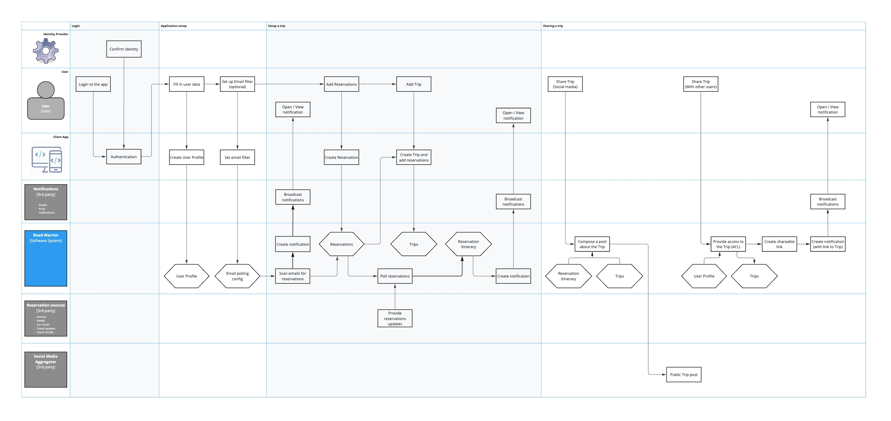

# Operational Viewpoint
> *Describes how the system will be operated when it is running on production environment.*

Here we connect the main user flow with the system context. The base things a user do in the application are:
- **Login**. The app needs to know who going to get help with his trips.
- **Setup application**. The user has to register a profile in the app to create a context and establish rules.
- **Setup a trip**. The travel is being planned, thus the user shares with the application what to track by adding reservations into the system.
- **Share a trip**. It is always useful to be able to share your experience easily.

Then the Road Warrior application steps into play. The application can collect reservations automatically, tracking updates and allows making changes. The system will inform the traveler and let him keep friends up to date.
 To do the staff, the system involves:

The client side:
- The user, firstly.
- The web/mobile application.

The Road Warrior system:
- All services we put on servers.  

A number of Third party we need to provide our features:
- **Identity providers for authentication**. So a user can use usual identity for simple login.
- **Reservation sources**. Travel agencies and travel systems where we can collect actual information and same time and efforts for the user.
- **Notifications services**, to keep the user informed regardless of the device he is using.
- **Social media aggregator**. The service connecting us to social networks.

The next schema shows how all it works together to satisfy  our users:

## Login
All users start from this place. We must maintain simplicity along with security. Users use many services every day, and they already have accounts. Simplicity here is the ability to share their identity between many services with clear and unified flow. Security from other side is a critical concern for the client. We have to guarantee protection of personal data and prevent any ways to steal the identity. To do so, we use well-known Identity Providers, like Google, Apple, Microsoft, to store and confirm the identity for our service.
The login process looks clear and secure – the user opens the Road Warrior application, then a well-known provider confirms the user’s identity and we can start. Moreover, using Single Sign On approach, we remove the necessity to enter credentials every time but let him stay in a secure environment and trust our service.

## Application setup
To start using the application, we need initial context from the user. He should create a profile in the Road Warrior to introduce herself. Then we let set up personal emails processing to reduce manual work. We ask the user to let us scan emails and find the reservation he made, then put them into the polling flow automatically. 

## Setup a trip
The mail things happen here.
Email scanning if set up finds reservations and we start tracking them. User can put any reservations manually. All the rest the system does on its own: with travel agencies and services, we track any changes to reservations then notify the user to keep him up to date and no worries about missing important details. The notifications are created automatically and sent with Notifications services directly to the client to show in the application. Moreover, at any time, the user can check actual reservations details and make the right decision about plans. 
Another feature we provide is the ability to group reservations into a trip. Often, users care more about a trip than single reservations, and we can help here. The user can put several reservations into the trip, then view and update travel details becomes much more comprehensive. 
All data about travel in one place, well organized and up to date – this is what we are going to provide for our clients.

## Share a trip
Another cool feature is sharing a trip. It is always nice to share your experiences, and some time it is important to keep friends and colleagues aware of your plans.
We provide two sharing scenarios:
1. Tell your story on a social media. With one click, the user can send a message about the selected trip to friends. The Road Warrior prepares the post from a template, puts the trip details there and sends it to any social media you select automatically.
2. If a user needs to provide more grained access to his trip for friends or colleagues, the Road Warrior can help. Other users just need to be in the Road Warrior application, and any travel data can be shared with them. The user selects a trip and connects other people to it. Thereafter, the system creates a shareable link, puts selected users on the trip with appropriate right and sends them a notification. The user can even let recipients manage reservations in the trip and receive notifications about updates. 

